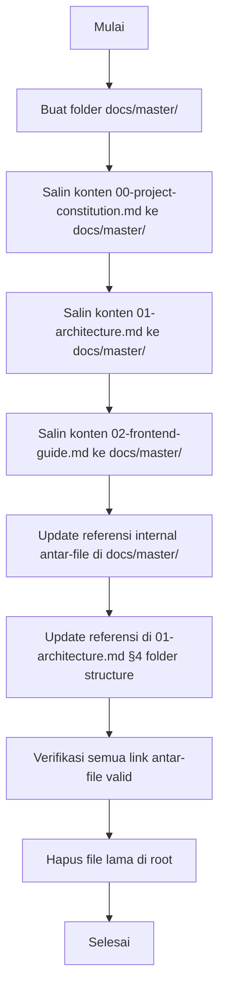

# Design Document: docs-master-migration

## Overview

Fitur ini memindahkan tiga file dokumentasi utama proyek (`00-project-constitution.md`, `01-architecture.md`, `02-frontend-guide.md`) dari root folder ke `docs/master/`, sesuai dengan struktur folder yang sudah didefinisikan di `01-architecture.md` (seksi §4 menyebut `docs/master/` sebagai lokasi resmi file-file guide). Selain memindahkan file, semua referensi silang antar-file dan referensi di `AGENTS.md` (jika ada) harus diperbarui agar tidak ada broken link.

Lingkup migrasi ini murni reorganisasi struktur folder — tidak ada perubahan konten substantif, tidak ada perubahan kode aplikasi, dan tidak ada penambahan dependency baru.

---

## Architecture

### Sebelum Migrasi

```
project-root/
├── 00-project-constitution.md   ← posisi saat ini
├── 01-architecture.md           ← posisi saat ini
├── 02-frontend-guide.md         ← posisi saat ini
├── AGENTS.md
├── app/
├── actions/
├── lib/
├── prisma/
└── ...
```

### Setelah Migrasi

```
project-root/
├── docs/
│   └── master/
│       ├── 00-project-constitution.md   ← posisi baru
│       ├── 01-architecture.md           ← posisi baru
│       └── 02-frontend-guide.md         ← posisi baru
├── AGENTS.md                            ← tidak berubah (tidak ada referensi ke docs)
├── app/
├── actions/
├── lib/
├── prisma/
└── ...
```

### Alur Migrasi



---

## Components and Interfaces

### File-File yang Terlibat

| File | Peran | Aksi |
|---|---|---|
| `00-project-constitution.md` | Dokumen fondasi proyek | Pindah ke `docs/master/` |
| `01-architecture.md` | Arsitektur sistem & data flow | Pindah ke `docs/master/`, update self-reference di §4 |
| `02-frontend-guide.md` | Panduan Frontend (App Router, komponen, konvensi) | Pindah ke `docs/master/` |
| `AGENTS.md` | Panduan untuk AI agent (Next.js rules) | Tidak ada referensi ke docs → tidak perlu diubah |

### Referensi Silang Antar-File

Berdasarkan pembacaan isi file, referensi yang ada saat ini:

```
01-architecture.md §4 menyebut:
  "detail FE ada di `02-frontend-guide.md`"
  → Path perlu diperbarui menjadi `docs/master/02-frontend-guide.md`

01-architecture.md §4 folder structure:
  "docs/master/   # file-file guide ini"
  → Sudah benar, tidak perlu diubah

00-project-constitution.md:
  Tidak ada referensi path ke file lain

02-frontend-guide.md:
  Tidak ada referensi path ke file lain

AGENTS.md:
  Tidak ada referensi ke file dokumentasi → tidak ada perubahan
```

---

## Data Models

### Pemetaan File Sumber → Tujuan

```
interface FileMigration {
  source: string        // path relatif dari project root
  destination: string   // path relatif dari project root
  hasInternalRefs: boolean  // apakah file ini punya referensi ke file lain
}

migrations: FileMigration[] = [
  {
    source: "00-project-constitution.md",
    destination: "docs/master/00-project-constitution.md",
    hasInternalRefs: false
  },
  {
    source: "01-architecture.md",
    destination: "docs/master/01-architecture.md",
    hasInternalRefs: true   // merujuk ke 02-frontend-guide.md
  },
  {
    source: "02-frontend-guide.md",
    destination: "docs/master/02-frontend-guide.md",
    hasInternalRefs: false
  }
]
```

### Peta Referensi Internal yang Harus Diperbarui

```
interface RefUpdate {
  file: string        // file yang mengandung referensi
  oldRef: string      // teks referensi lama
  newRef: string      // teks referensi baru
}

refUpdates: RefUpdate[] = [
  {
    file: "docs/master/01-architecture.md",
    oldRef: "`02-frontend-guide.md`",
    newRef: "`docs/master/02-frontend-guide.md`"
  }
]
```

---

## Algorithmic Pseudocode

### Algoritma Utama: Eksekusi Migrasi

```pascal
ALGORITHM executeMigration()
INPUT: daftar FileMigration, daftar RefUpdate
OUTPUT: status migrasi (sukses / gagal beserta alasan)

PRECONDITIONS:
  - Folder project root dapat diakses
  - Ketiga file sumber ada di root
  - Folder docs/master/ belum ada atau sudah ada tapi kosong

POSTCONDITIONS:
  - Ketiga file ada di docs/master/
  - Tidak ada file lama tersisa di root
  - Semua referensi internal sudah diperbarui
  - AGENTS.md tidak berubah

BEGIN
  // Step 1: Validasi kondisi awal
  FOR each migration IN migrations DO
    IF file_exists(migration.source) = false THEN
      RETURN Error("File tidak ditemukan: " + migration.source)
    END IF
  END FOR

  // Step 2: Buat folder target
  IF folder_exists("docs/master/") = false THEN
    create_folder("docs/")
    create_folder("docs/master/")
  END IF

  // Step 3: Salin konten file ke lokasi baru
  FOR each migration IN migrations DO
    content ← read_file(migration.source)
    write_file(migration.destination, content)
    ASSERT file_exists(migration.destination) = true
  END FOR

  // Step 4: Perbarui referensi internal
  FOR each update IN refUpdates DO
    content ← read_file(update.file)
    IF contains(content, update.oldRef) THEN
      content ← replace(content, update.oldRef, update.newRef)
      write_file(update.file, content)
    END IF
  END FOR

  // Step 5: Verifikasi referensi sudah benar
  FOR each update IN refUpdates DO
    content ← read_file(update.file)
    ASSERT contains(content, update.newRef) = true
    ASSERT contains(content, update.oldRef) = false
  END FOR

  // Step 6: Hapus file lama di root
  FOR each migration IN migrations DO
    delete_file(migration.source)
    ASSERT file_exists(migration.source) = false
  END FOR

  RETURN Success
END
```

**Loop Invariants:**
- Step 3: Setiap iterasi, file yang sudah disalin tetap utuh (konten tidak berubah)
- Step 4: Setiap iterasi, file yang sudah diupdate tidak memiliki referensi lama lagi
- Step 6: Setiap iterasi, file yang sudah dihapus tidak mempengaruhi file yang belum dihapus

### Algoritma Validasi Referensi

```pascal
ALGORITHM validateRefs(docsFolder)
INPUT: path ke docs/master/
OUTPUT: daftar broken links (kosong = semua valid)

BEGIN
  brokenLinks ← []
  
  FOR each file IN list_files(docsFolder) DO
    content ← read_file(file)
    refs ← extract_markdown_links(content)
    
    FOR each ref IN refs DO
      IF is_relative_path(ref) THEN
        resolvedPath ← resolve_path(file, ref)
        IF file_exists(resolvedPath) = false THEN
          brokenLinks.add({ file: file, ref: ref })
        END IF
      END IF
    END FOR
  END FOR
  
  RETURN brokenLinks
END
```

---

## Key Functions with Formal Specifications

### createFolder(path)

```
FUNCTION createFolder(path: string): void
```

**Preconditions:**
- `path` tidak kosong
- Parent folder dari `path` sudah ada (untuk `docs/master/`, parent `docs/` dibuat lebih dulu)

**Postconditions:**
- Folder `path` ada setelah fungsi selesai
- Idempotent: jika folder sudah ada, tidak error

### copyFileContent(source, destination)

```
FUNCTION copyFileContent(source: string, destination: string): void
```

**Preconditions:**
- `source` adalah path valid ke file yang ada
- `destination` adalah path valid (folder parentnya sudah ada)

**Postconditions:**
- Konten `destination` identik dengan `source`
- File `source` tidak berubah (ini copy, bukan move)
- Metadata konten (heading, link internal) tetap sama

### updateReference(filePath, oldRef, newRef)

```
FUNCTION updateReference(filePath: string, oldRef: string, newRef: string): void
```

**Preconditions:**
- `filePath` ada dan bisa dibaca/ditulis
- `oldRef` adalah string yang ada di dalam file

**Postconditions:**
- Semua kemunculan `oldRef` di `filePath` diganti dengan `newRef`
- Tidak ada perubahan lain pada konten file di luar penggantian tersebut

### deleteFile(path)

```
FUNCTION deleteFile(path: string): void
```

**Preconditions:**
- `path` ada sebagai file
- File di lokasi baru (`destination`) sudah berhasil dibuat dan terverifikasi

**Postconditions:**
- File di `path` tidak ada lagi
- Tidak ada file lain yang terpengaruh

---

## Example Usage

```pascal
// Contoh urutan eksekusi lengkap

SEQUENCE migrateDocs
  // 1. Validasi
  ASSERT file_exists("00-project-constitution.md")
  ASSERT file_exists("01-architecture.md")
  ASSERT file_exists("02-frontend-guide.md")

  // 2. Buat folder
  create_folder("docs/")
  create_folder("docs/master/")

  // 3. Salin file
  copyFileContent("00-project-constitution.md", "docs/master/00-project-constitution.md")
  copyFileContent("01-architecture.md",          "docs/master/01-architecture.md")
  copyFileContent("02-frontend-guide.md",        "docs/master/02-frontend-guide.md")

  // 4. Update referensi di 01-architecture.md
  updateReference(
    "docs/master/01-architecture.md",
    "`02-frontend-guide.md`",
    "`docs/master/02-frontend-guide.md`"
  )

  // 5. Verifikasi
  brokenLinks ← validateRefs("docs/master/")
  ASSERT brokenLinks = []

  // 6. Hapus file lama
  deleteFile("00-project-constitution.md")
  deleteFile("01-architecture.md")
  deleteFile("02-frontend-guide.md")

  DISPLAY "Migrasi selesai. Semua file ada di docs/master/"
END SEQUENCE
```

---

## Correctness Properties

1. **Completeness**: Setelah migrasi selesai, `∀ file ∈ {00-project-constitution.md, 01-architecture.md, 02-frontend-guide.md}`, file tersebut ada di `docs/master/` dan tidak ada di root.

2. **Content Preservation**: Konten setiap file yang dimigrasikan identik dengan konten aslinya, kecuali referensi path yang memang diperbarui secara eksplisit.

3. **Reference Integrity**: Setelah migrasi, semua referensi relatif antar-file di dalam `docs/master/` dapat di-resolve ke file yang ada.

4. **No Collateral Damage**: File-file di luar lingkup migrasi (`AGENTS.md`, seluruh kode di `app/`, `actions/`, `lib/`, dll.) tidak mengalami perubahan konten apa pun.

5. **Idempotency**: Jika migrasi dijalankan ulang pada kondisi yang sudah selesai, hasilnya sama — tidak ada error, tidak ada duplikasi.

---

## Error Handling

### Skenario 1: File Sumber Tidak Ditemukan

**Kondisi**: Salah satu dari tiga file tidak ada di root saat migrasi dimulai.

**Respons**: Batalkan seluruh proses, tampilkan nama file yang tidak ditemukan.

**Pemulihan**: Cek apakah file sudah pernah dipindahkan sebelumnya. Jika sudah ada di `docs/master/`, migrasi mungkin sudah pernah dijalankan sebagian.

### Skenario 2: Folder `docs/master/` Sudah Ada dan Berisi File

**Kondisi**: `docs/master/` sudah dibuat sebelumnya dan sudah berisi file dengan nama yang sama.

**Respons**: Timpa file yang ada (overwrite) karena sumber kebenaran adalah file di root.

**Pemulihan**: Tidak diperlukan — overwrite adalah perilaku yang diharapkan.

### Skenario 3: Referensi Tidak Ditemukan di File

**Kondisi**: String `oldRef` yang ingin diperbarui tidak ditemukan di file target.

**Respons**: Catat sebagai warning (bukan error fatal) — referensi mungkin sudah pernah diperbarui.

**Pemulihan**: Lanjutkan ke langkah berikutnya, verifikasi akhir akan menangkap jika ada referensi yang masih salah.

---

## Testing Strategy

### Unit Testing Approach

Setiap fungsi (createFolder, copyFileContent, updateReference, deleteFile) diuji secara independen dengan:
- Input valid → output sesuai postcondition
- Input invalid → error yang sesuai

### Integration Testing Approach

Jalankan urutan migrasi lengkap pada salinan temporary struktur folder dan verifikasi:
1. Ketiga file ada di `docs/master/` dengan konten yang benar
2. Ketiga file tidak lagi ada di root
3. Referensi di `01-architecture.md` sudah menunjuk ke path baru
4. `AGENTS.md` tidak berubah

### Manual Verification Checklist

Setelah migrasi dieksekusi:
- [ ] `docs/master/00-project-constitution.md` ada dan konten lengkap
- [ ] `docs/master/01-architecture.md` ada dan referensi ke `02-frontend-guide.md` sudah menggunakan path `docs/master/02-frontend-guide.md`
- [ ] `docs/master/02-frontend-guide.md` ada dan konten lengkap
- [ ] `00-project-constitution.md` di root sudah tidak ada
- [ ] `01-architecture.md` di root sudah tidak ada
- [ ] `02-frontend-guide.md` di root sudah tidak ada
- [ ] `AGENTS.md` tidak berubah
- [ ] `pnpm build` tetap lolos (migrasi tidak menyentuh kode)

---

## Performance Considerations

Tidak ada concern performa — ini operasi file system sederhana pada tiga file teks kecil (total < 50 KB). Seluruh proses selesai dalam milidetik.

---

## Security Considerations

- Tidak ada data sensitif yang ditangani (hanya file Markdown dokumentasi).
- Tidak ada perubahan pada konfigurasi environment, dependency, atau kode aplikasi.
- Tidak ada perubahan pada RLS, auth, atau otorisasi.

---

## Dependencies

Tidak ada dependency tambahan. Operasi ini menggunakan kemampuan file system dasar yang tersedia di environment apa pun (Windows/Linux/macOS). Tidak ada library atau tool khusus yang dibutuhkan di luar apa yang sudah ada di project.
