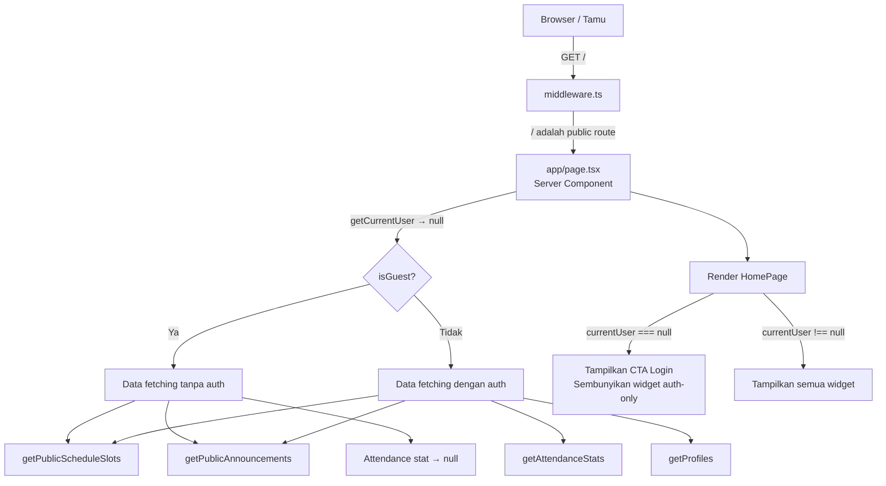
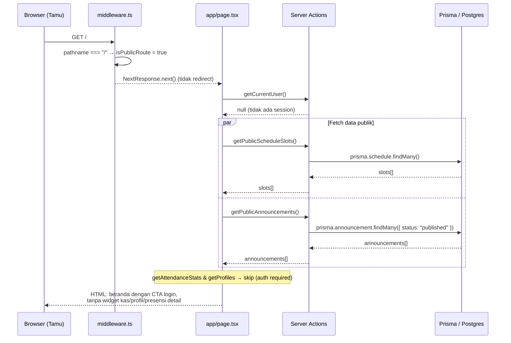
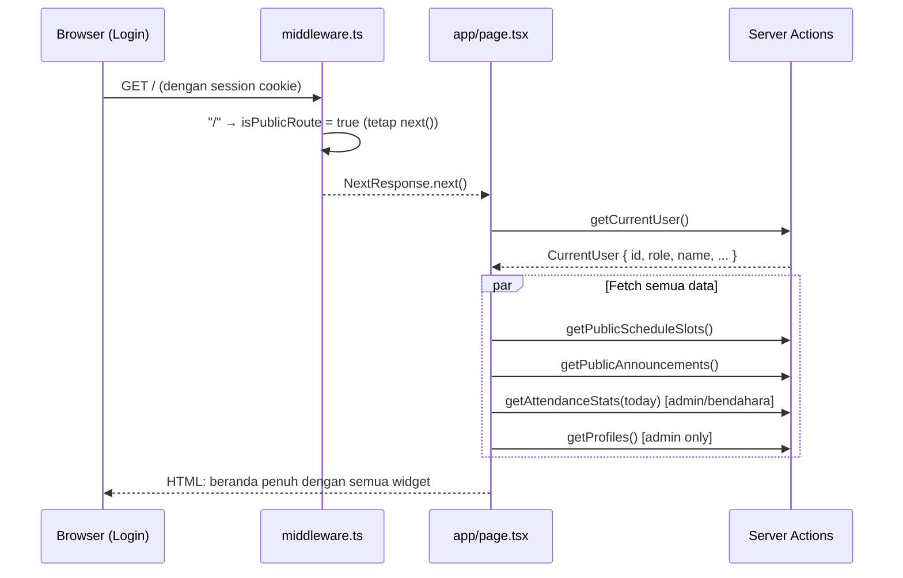

# Design Document: Guest Access Homepage

## Overview

Fitur ini mengizinkan pengguna yang belum login (tamu/guest) untuk mengakses halaman beranda (`/`) tanpa perlu melakukan autentikasi terlebih dahulu. Saat ini semua route non-publik dilindungi oleh middleware yang meredirect ke `/login` — halaman beranda perlu dikecualikan dari proteksi tersebut, sementara data yang ditampilkan disesuaikan agar aman dan relevan untuk tamu.

Pendekatan desain mengikuti pola "graceful degradation": tamu dapat melihat informasi publik (pengumuman terpublikasi, jadwal hari ini, statistik kehadiran umum), sementara fitur yang memerlukan identitas (kas pribadi, profil lengkap anggota kelas, navigasi admin) hanya tampil untuk pengguna yang sudah login.

---

## Architecture

### Lapisan yang Terpengaruh



### Ringkasan Perubahan

| Layer | File | Perubahan |
|---|---|---|
| Middleware | `lib/supabase/middleware.ts` | Tambah `/` sebagai public route |
| Action | `actions/schedule.actions.ts` | Tambah `getPublicScheduleSlots()` tanpa auth |
| Action | `actions/announcement.actions.ts` | Tambah `getPublicAnnouncements()` tanpa auth |
| Page | `app/page.tsx` | Refactor data fetching kondisional + UI guest mode |

---

## Sequence Diagrams

### Alur: Tamu Mengakses Beranda



### Alur: Pengguna Login → Beranda Penuh



---

## Components and Interfaces

### 1. Middleware — `lib/supabase/middleware.ts`

**Tujuan**: Mengizinkan `/` sebagai public route.

**Interface saat ini**:
```typescript
const isPublicRoute =
  isAuthRoute ||
  pathname.startsWith("/auth/") ||
  pathname.startsWith("/api/auth/") ||
  pathname === "/api/ping";
```

**Interface setelah perubahan**:
```typescript
const isPublicRoute =
  isAuthRoute ||
  pathname === "/" ||                   // ← TAMBAHAN
  pathname.startsWith("/auth/") ||
  pathname.startsWith("/api/auth/") ||
  pathname === "/api/ping";
```

**Tanggung Jawab**:
- Refresh session cookie jika ada
- Tidak meredirect ke `/login` untuk path `/`
- Tetap meredirect semua route lain yang dilindungi

---

### 2. Public Schedule Action — `actions/schedule.actions.ts`

**Tujuan**: Mengambil slot jadwal tanpa memerlukan session.

**Interface**:
```typescript
/**
 * Returns all schedule slots — no authentication required.
 * Used by the homepage for guest and authenticated users alike.
 */
export async function getPublicScheduleSlots(): Promise<Schedule[]>
```

**Tanggung Jawab**:
- Query `prisma.schedule.findMany()` langsung tanpa `requireAuth()`
- Digunakan oleh homepage untuk semua jenis pengguna (tamu maupun login)
- Read-only, tidak ada mutasi data

---

### 3. Public Announcements Action — `actions/announcement.actions.ts`

**Tujuan**: Mengambil pengumuman terpublikasi tanpa memerlukan session.

**Interface**:
```typescript
/**
 * Returns only published announcements — no authentication required.
 * Safe for guest/unauthenticated access.
 */
export async function getPublicAnnouncements(): Promise<Announcement[]>
```

**Tanggung Jawab**:
- Query `prisma.announcement.findMany({ where: { status: "published" } })` langsung
- **Tidak pernah** mengembalikan draft — filter `status: "published"` adalah invariant keamanan
- Tidak mengenal role pengguna

---

### 4. Homepage Page — `app/page.tsx`

**Tujuan**: Beranda yang berfungsi untuk tamu maupun pengguna login.

**Interface** (logika kondisional):
```typescript
export default async function HomePage() {
  const currentUser = await getCurrentUser(); // null untuk tamu
  const isGuest = currentUser === null;

  // Data publik — selalu di-fetch
  const [slots, announcements] = await Promise.all([
    getPublicScheduleSlots(),
    getPublicAnnouncements(),
  ]);

  // Data auth-only — hanya di-fetch jika login
  const attendanceResult = !isGuest
    ? await getAttendanceStats(todayStr)
    : null;

  const profiles = !isGuest && currentUser.role === 'admin'
    ? await getProfiles()
    : [];

  // ... render dengan mode guest atau full
}
```

**Tanggung Jawab**:
- Menentukan status tamu/login berdasarkan `currentUser === null`
- Hanya memanggil action yang membutuhkan auth ketika pengguna sudah login
- Menampilkan CTA "Masuk / Daftar" untuk tamu di area hero
- Menyembunyikan widget kehadiran (detail) dan anggota kelas untuk tamu
- Menampilkan pesan informatif di widget yang dikunci untuk tamu

---

## Data Models

### GuestContext (konseptual, bukan tipe baru)

```typescript
// Tidak ada tipe baru yang diperlukan.
// Kondisi tamu cukup direpresentasikan oleh:
const isGuest: boolean = currentUser === null;
```

### Widget Visibility Matrix

| Widget | Tamu (guest) | Murid (login) | Admin/Bendahara |
|---|---|---|---|
| Hero + CTA Login | ✅ tampil CTA login | ✅ tampil sapaan | ✅ tampil sapaan |
| Countdown UTS | ✅ | ✅ | ✅ |
| Pengumuman Terbaru | ✅ (published only) | ✅ (published only) | ✅ (semua) |
| Jadwal Hari Ini | ✅ | ✅ | ✅ |
| Kehadiran Hari Ini | 🔒 (placeholder login) | 🔒 (placeholder login) | ✅ (data real) |
| Akses Cepat | ✅ (link ke halaman lain) | ✅ | ✅ |
| Anggota Kelas | 🔒 (placeholder) | 🔒 (placeholder) | ✅ |

> **Catatan**: Widget kehadiran dan anggota kelas hanya menampilkan data real untuk admin/bendahara. Murid yang sudah login juga melihat placeholder di kedua widget ini — konsisten dengan logika `requireRole` yang sudah ada di `getAttendanceStats` dan `getProfiles`.

---

## Key Functions with Formal Specifications

### `getPublicScheduleSlots()`

```typescript
export async function getPublicScheduleSlots(): Promise<Schedule[]>
```

**Preconditions:**
- Tidak ada — fungsi ini boleh dipanggil tanpa session aktif
- Koneksi database tersedia

**Postconditions:**
- Mengembalikan array `Schedule[]` (bisa kosong jika belum ada data)
- Tidak pernah throw — error ditangkap dan mengembalikan `[]`
- Tidak ada side effect (read-only)

**Loop Invariants:** N/A

---

### `getPublicAnnouncements()`

```typescript
export async function getPublicAnnouncements(): Promise<Announcement[]>
```

**Preconditions:**
- Tidak ada — fungsi ini boleh dipanggil tanpa session aktif

**Postconditions:**
- **INVARIANT KEAMANAN**: `∀ a ∈ result: a.status === "published"` — tidak ada draft yang bocor
- Mengembalikan array `Announcement[]` yang diurutkan berdasarkan `createdAt: 'desc'`
- Tidak pernah throw — error ditangkap dan mengembalikan `[]`

**Loop Invariants:** N/A

---

### `updateSession()` (middleware) — perubahan kondisi

```typescript
// Sebelum:
const isPublicRoute = isAuthRoute || pathname.startsWith("/auth/") || ...;

// Sesudah:
const isPublicRoute = isAuthRoute || pathname === "/" || pathname.startsWith("/auth/") || ...;
```

**Preconditions:**
- `request.nextUrl.pathname` adalah string valid

**Postconditions:**
- Jika `pathname === "/"`: tidak ada redirect ke `/login`, bahkan jika tidak ada session
- Jika `pathname === "/"` dan ada session valid: session cookie di-refresh, request dilanjutkan
- Semua route lain yang tidak termasuk `isPublicRoute` tetap dilindungi (tidak berubah)

---

## Algorithmic Pseudocode

### Algoritma Utama: Render Beranda Kondisional

```pascal
ALGORITHM renderHomePage()
INPUT: HTTP Request (mungkin tanpa session cookie)
OUTPUT: HTML beranda yang sesuai dengan status autentikasi

BEGIN
  // 1. Ambil user — null jika tamu
  currentUser ← await getCurrentUser()
  isGuest ← (currentUser = null)

  // 2. Selalu fetch data publik
  [slots, announcements] ← await Promise.all([
    getPublicScheduleSlots(),
    getPublicAnnouncements()
  ])

  // 3. Fetch data auth-only secara kondisional
  IF NOT isGuest AND currentUser.role IN ["admin", "bendahara"] THEN
    attendanceResult ← await getAttendanceStats(today)
  ELSE
    attendanceResult ← null
  END IF

  IF NOT isGuest AND currentUser.role = "admin" THEN
    profiles ← await getProfiles()
  ELSE
    profiles ← []
  END IF

  // 4. Filter jadwal hari ini
  todayDow ← convertToDayOfWeek(new Date())
  todaySlots ← slots
    .filter(s → s.dayOfWeek = todayDow AND NOT s.isBreak)
    .sort(asc periodOrder)

  // 5. Filter pengumuman published
  publishedAnnouncements ← announcements
    .filter(a → a.status = "published")

  // 6. Render
  RETURN renderHTML({
    currentUser,
    isGuest,
    todaySlots,
    publishedAnnouncements,
    attendanceResult,
    profiles
  })
END
```

---

### Algoritma: Logika Public Route di Middleware

```pascal
ALGORITHM isPublicRoute(pathname)
INPUT: pathname of type String
OUTPUT: isPublic of type Boolean

BEGIN
  isAuthRoute ← (pathname = "/login" OR pathname = "/signup")

  RETURN
    isAuthRoute
    OR pathname = "/"                  // ← TAMBAHAN untuk guest access
    OR pathname.startsWith("/auth/")
    OR pathname.startsWith("/api/auth/")
    OR pathname = "/api/ping"
END
```

**Preconditions:**
- `pathname` dimulai dengan `/`

**Postconditions:**
- Mengembalikan `true` jika dan hanya jika route tidak memerlukan session
- `pathname = "/"` selalu mengembalikan `true`

---

## Example Usage

### Contoh 1: Tamu mengakses beranda

```typescript
// Tamu membuka https://web-kelas.vercel.app/
// middleware: "/" → isPublicRoute = true → tidak redirect
// page.tsx:
const currentUser = await getCurrentUser(); // → null

// Data publik di-fetch:
const slots = await getPublicScheduleSlots();         // → Schedule[]
const announcements = await getPublicAnnouncements(); // → Announcement[] (published only)

// Data auth-only TIDAK di-fetch:
// getAttendanceStats → skip
// getProfiles → skip

// Render:
// Hero: "Selamat Datang! Masuk / Daftar untuk akses penuh"
// Widget kehadiran: "🔒 Login untuk melihat data kehadiran"
// Widget anggota: "🔒 Login untuk melihat anggota kelas"
```

### Contoh 2: Murid login mengakses beranda

```typescript
const currentUser = await getCurrentUser(); // → { id, role: "murid", name: "Budi" }

// Data publik + beberapa data auth:
const slots = await getPublicScheduleSlots();
const announcements = await getPublicAnnouncements();
// getAttendanceStats → skip (murid bukan admin/bendahara)
// getProfiles → skip (bukan admin)

// Hero: "Halo, Budi!"
// Widget kehadiran: "🔒 Data hanya tersedia untuk admin"
// Widget anggota: "🔒 Data hanya tersedia untuk admin"
```

### Contoh 3: Admin login mengakses beranda

```typescript
const currentUser = await getCurrentUser(); // → { id, role: "admin", name: "Pak Guru" }

// Semua data di-fetch:
const [slots, announcements] = await Promise.all([...]);
const attendanceResult = await getAttendanceStats(today); // ✅
const profiles = await getProfiles();                     // ✅

// Render lengkap: semua widget menampilkan data real
```

---

## Correctness Properties

### Property 1: Tamu tidak pernah diredirect dari beranda
```
∀ request: pathname(request) = "/" ⟹ middleware tidak menghasilkan redirect ke "/login"
```

**Validates: Requirements 1.1, 1.2**

### Property 2: Keamanan data draft — invariant tidak boleh dilanggar
```
∀ a ∈ getPublicAnnouncements(): a.status = "published"
```
Ini berarti: tidak ada kondisi (session ada, tidak ada, error, dll) di mana `getPublicAnnouncements()` bisa mengembalikan draft.

**Validates: Requirements 3.2, 3.5**

### Property 3: Route lain tetap terlindungi
```
∀ pathname ∉ { "/", "/login", "/signup", "/auth/**", "/api/auth/**", "/api/ping" }:
  !isAuthenticated(request) ⟹ redirect("/login")
```

**Validates: Requirements 1.3, 1.4**

### Property 4: Data auth-only tidak pernah di-fetch untuk tamu
```
currentUser = null ⟹ getAttendanceStats() tidak dipanggil
currentUser = null ⟹ getProfiles() tidak dipanggil
```

**Validates: Requirements 4.2, 4.3**

### Property 5: UI konsisten dengan status autentikasi
```
isGuest = true ⟹ CTA login muncul di hero section
isGuest = false ⟹ sapaan dengan nama pengguna muncul di hero section
```

**Validates: Requirements 5.1, 5.2**

---

## Error Handling

### Skenario 1: Database tidak tersedia saat tamu mengakses beranda

**Kondisi**: Prisma gagal terhubung ke Supabase (misalnya project paused di free tier)

**Respons**:
- `getPublicScheduleSlots()` menangkap error di catch block dan mengembalikan `[]`
- `getPublicAnnouncements()` menangkap error dan mengembalikan `[]`
- Halaman tetap render dengan empty state yang informatif (bukan 500 error)

**Recovery**: Widget menampilkan empty state standar ("Belum ada jadwal", "Tidak ada pengumuman")

---

### Skenario 2: Middleware gagal (env vars hilang)

**Kondisi**: `NEXT_PUBLIC_SUPABASE_URL` atau key tidak tersedia

**Respons**: Middleware saat ini sudah menangani ini — jika `isPublicRoute` (termasuk `/`), tidak redirect. Tamu tetap bisa mengakses beranda meski dengan fungsi terbatas.

---

### Skenario 3: `getCurrentUser()` throw di halaman beranda

**Kondisi**: Supabase auth service tidak merespons

**Respons**: `getCurrentUser()` sudah memiliki try/catch yang mengembalikan `null`. Halaman otomatis masuk mode guest tanpa crash.

---

## Testing Strategy

### Unit Testing

**Target**: Fungsi `isPublicRoute` logic di middleware dan fungsi-fungsi public action.

```typescript
// Test: "/" selalu public
expect(isPublicRoute("/")).toBe(true);

// Test: "/forum" tidak public
expect(isPublicRoute("/forum")).toBe(false);

// Test: getPublicAnnouncements hanya mengembalikan published
const results = await getPublicAnnouncements();
results.forEach(a => expect(a.status).toBe("published"));
```

### Property-Based Testing

**Library**: `fast-check`

**Property 1 — Draft tidak bocor**:
```typescript
fc.assert(
  fc.asyncProperty(fc.constant(undefined), async () => {
    const results = await getPublicAnnouncements();
    return results.every(a => a.status === "published");
  }),
  { numRuns: 50 }
);
```

**Property 2 — Route protection tidak terpengaruh**:
```typescript
fc.assert(
  fc.property(
    fc.string().filter(s => s.startsWith("/") && s !== "/" && !s.startsWith("/auth")),
    (pathname) => {
      const result = checkIsPublicRoute(pathname);
      return result === false; // semua non-listed routes tetap protected
    }
  ),
  { numRuns: 500 }
);
```

### Integration Testing

- Test E2E: browser tanpa cookie mengakses `/` → halaman beranda ter-render (bukan redirect ke login)
- Test E2E: browser tanpa cookie mengakses `/forum` → diredirect ke `/login`
- Test E2E: browser tanpa cookie mengakses `/kas` → diredirect ke `/login`
- Test visual: hero section menampilkan CTA login untuk tamu, sapaan nama untuk pengguna login

---

## Performance Considerations

- `getPublicScheduleSlots()` dan `getPublicAnnouncements()` adalah read-only queries sederhana — tidak ada N+1
- Untuk tamu, `Promise.all()` hanya menjalankan dua queries (vs. empat untuk admin) — load lebih ringan
- Data publik di beranda bisa di-cache dengan `revalidatePath('/')` saat ada update jadwal atau pengumuman baru — ini sudah terjadi di action yang ada
- Tidak diperlukan perubahan pada strategi caching Next.js — `export const dynamic = 'force-dynamic'` di `layout.tsx` sudah mengakomodasi ini

---

## Security Considerations

1. **RLS tetap aktif**: Meskipun action publik tidak memanggil `requireAuth()`, query Prisma ke database tetap dieksekusi dengan kredensial server. RLS di Supabase menggunakan `SECURITY DEFINER` untuk `is_admin()` dan `is_treasurer_or_admin()` — fungsi `getPublicScheduleSlots()` menggunakan Prisma (bukan Supabase client), sehingga berjalan dengan hak server, bukan hak anonymous user. Ini aman selama data schedule dan published announcement memang dimaksudkan publik.

2. **Draft tidak pernah bocor**: `getPublicAnnouncements()` di-hard-code dengan filter `{ status: "published" }` — tidak ada parameter yang bisa dimanipulasi pengguna untuk mengubah filter ini.

3. **Route lain tidak terpengaruh**: Perubahan `isPublicRoute` hanya menambahkan `pathname === "/"` — seluruh logika proteksi route lain tidak berubah.

4. **Tidak ada data pribadi untuk tamu**: Widget yang menampilkan data sensitif (presensi individual, daftar anggota dengan nama/avatar) hanya muncul untuk role yang sesuai. Tamu tidak melihat informasi identitas siswa.

5. **authorId aman**: `getCurrentUser()` mengembalikan `null` untuk tamu — tidak ada aksi mutasi yang bisa dijalankan dari homepage tanpa login.

---

## Dependencies

Tidak ada dependency baru yang perlu diinstall. Semua perubahan menggunakan:
- `@supabase/ssr` (sudah ada) — untuk session check di middleware
- `next/server` (sudah ada) — `NextRequest`, `NextResponse`
- `@prisma/client` via `lib/db` (sudah ada) — untuk queries publik
- Komponen React dan Tailwind CSS yang sudah ada di project
